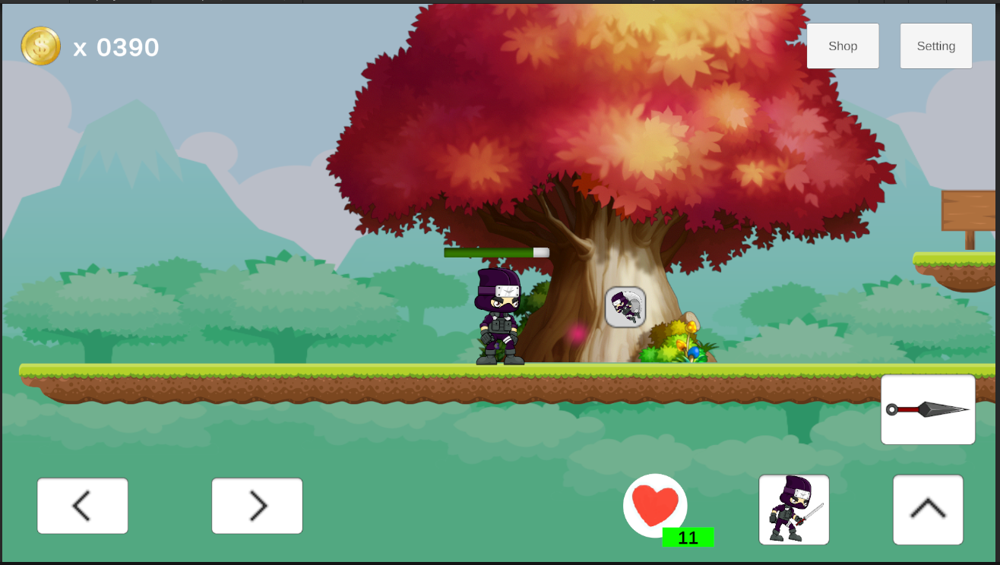
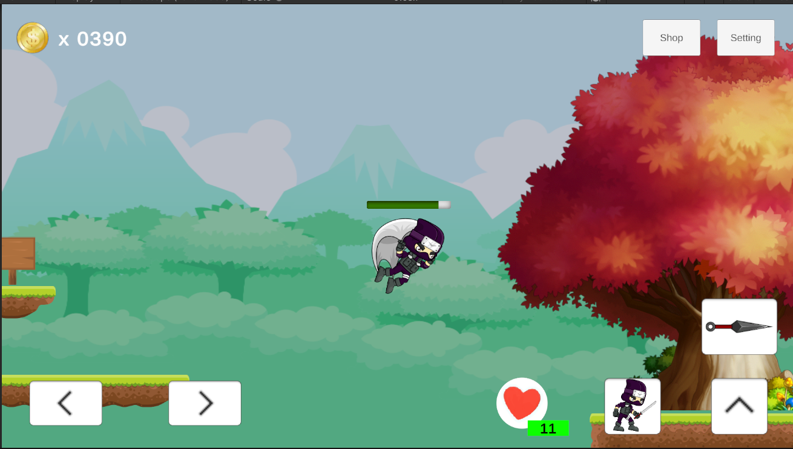
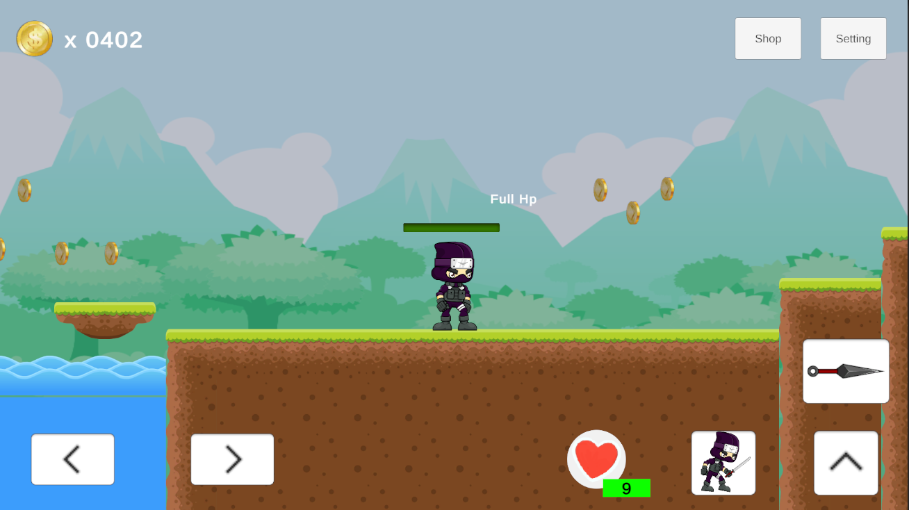
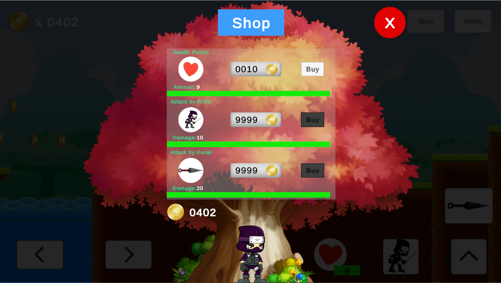
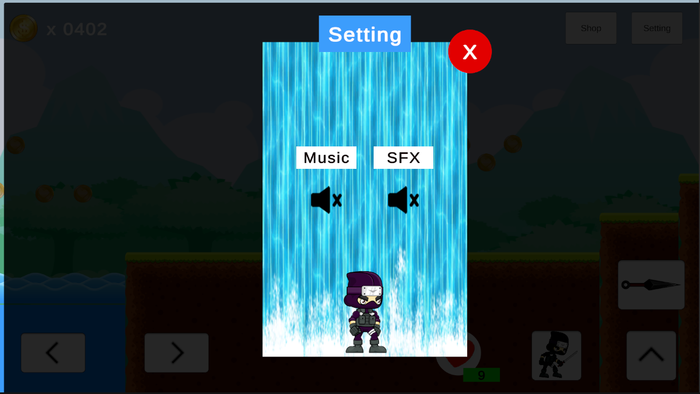
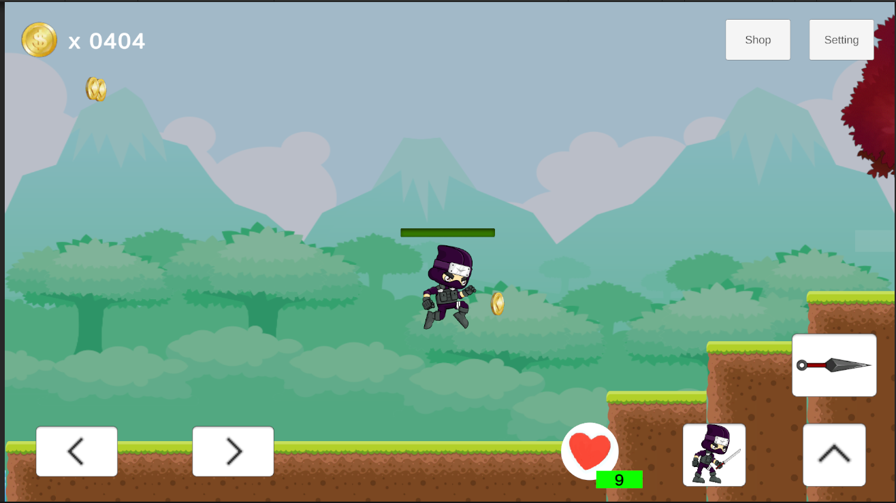
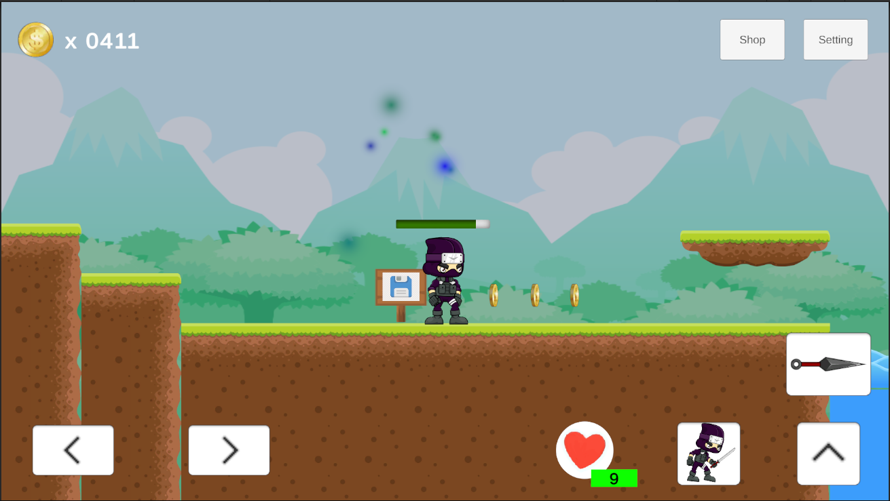

# Chuẩn bị câu hỏi

#### 1. Singleton là gì? Tác dụng thế nào?
- Singleton là một design pattern đảm bảo chỉ có một instance của một lớp được tạo ra trong toàn bộ chương trình và cung cấp một điểm truy cập đến nó để sử dụng các phương thức.
- Tác dụng: 
  - Tiết kiệm tài nguyên: không cần tạo mới ở mỗi lớp.
  - Tránh việc chồng chất instance lên nhau.
  - Dễ quản lý: dùng 1 class quản lý có singleton kiểu để quản lý toàn bộ chức năng nhất định của trò chơi.

#### 2. Mô tả cách thức hoạt động của State Machine
- Là mô hình quản lý state, thường dùng cho bot, anim,...
- Cách hoạt động:
  - Mỗi trạng thái là một class (ví dụ: Idle, Patrol, Attack) có các hàm như OnEnter(), OnExecute(), OnExit().
  - State Machine giữ trạng thái hiện tại và gọi OnExecute() mỗi frame.
  - Khi đổi trạng thái, nó gọi OnExit() của trạng thái cũ và OnEnter() của trạng thái mới
  - Trạng thái có thể tự quyết định khi nào chuyển tiếp.

#### 3. Mô tả cách thức hoạt động của Knife
- Hình dạng tấn công bằng dao.
- Cách hoạt động: 
  - Chém: Ấn nút J hoặc ấn vào UI trên màn hình => đặt trạng thái attack = true.
  - Va chạm: 
    - tạo ra 1 attackArea
    - khi va chạm với character(player, enemy) => Character gọi tới hàm OnHit(float damage).
    - Sau 0.4s => đặt trạng thái attack = false.

#### 4. Mô tả cách ý tưởng tính năng mới của mình

##### 4.1 OpenSkill khi đánh quái
- Ý tưởng: 
  - Dựa trên việc có anim Glide và tạo được địa hình cao và dài.
  - Việc nhảy sang cũng được nhưng phải cài thêm về lực nhảy và trọng lực => cảm thấy không hợp lí lắm vì nếu vậy các địa hình thấp và gần sẽ bị vượt qua nhanh => Nghĩ tới làm Glide
  -  Nhưng mà làm người chơi có sẵn chức năng ấy thì không có sự thử thách => người chơi phải làm gì đấy mới mở được kĩ năng Glide => Đánh quái rơi vật phẩm.
- Tính năng:
  - Người chơi đánh quái sẽ có xác suất rơi ra boxOpenSkill (hiện tại mới có rơi ra glide, tỉ lệ 100% với con quái thứ 2 ở map).

  - Khi người chơi ăn boxOpenSkill mang hình glide đó thì người chơi sẽ unlock được skill và bay sang vực bên kia. (chưa lưu glide vào prefs).

  - Trong trường hợp người chơi k unlock skill này thì vực bên kia không thể bay qua.

##### 4.2 Shop và health potion
- Ý tưởng: 
  - Vì game có 1 map và muốn trau chuốt hết vào 1 map mà setDamage và setHp của nhân vật và kẻ địch cùng 1 mức thì nó gây ra sự nhanh chóng và nhám chán quá => setDamage và setHp khác nhau.
  - Thử setDamage và setHp của kẻ địch lên cao hơn 1 mức so với player => player phải có cái gì đấy hỗ trợ => hồi máu, tăng damage.
- Tính năng: 
  -  Khi có lọ máu và ấn vào nút hồi máu thì nó sẽ healing và sinh ra vfx hồi máu.

  - Trong trường hợp đầy máu rồi hoặc không còn lọ máu nào thì nó sẽ hiện ra text cảnh báo.

  - Nếu hết bình máu có thể vào cửa hàng mua, cửa hàng có thể mua đồ tăng damage nếu có tiền. (bình máu, damage knife của player, damage kunai của player, coin đều được lưu trong prefs để làm shop)

##### 4.3 Các tính năng nhỏ
- Ý tưởng: đều xuất phát từ việc tăng trải nghiệm người chơi.
- Tính năng:
    - Sound: có BGM, SFX (background Music và Sound Effect), đã được lưu trong prefs
    
    - Coin khi va chạm vào người dùng thì di chuyển lên icon coin ở trên.
    
    - SavePoint có thêm hình ảnh và particle để đánh dấu đã save ở đó.
    
    - Các anim khác: sleepIdle, JumpAttack, JumpThrow.

#### 5. Mô tả Moving Platform, tại sao Player có thể đứng trên đó
- Moving Platform là dạng di chuyển của khối vật thể trên không trung.
- Moving Platform hoạt động:
  - Khối vật thể bắt đầu di chuyển theo hướng xác định bằng transform
  - Có giới hạn 2 đầu. Nếu chạm vào 1 trong 2 đầu thì đổi hướng bằng cách kiểm tra khoảng cách giữa nó và mỗi đầu.

- Việc Player có thể đứng trên đó là vì:
  - Nó được làm giống ground (có collider) và player có rb, collider.
  - Để đảm bảo player không bị ảnh hưởng của các lực và vật lý xung quanh thì parent transform của player bằng transform của moving platform => Đảm bảo MP di chuyển đến đâu thì Player cũng sẽ tương đối đến ấy. (giống việc mình ngồi yên trong xe ô tô :>).

#### 6. Mô tả Health Bar, tại sao không gắn nó trực tiếp vào nhân vật
- Health Bar là thanh máu của nhân vật.
- Health Bar hoạt động:
  - Dùng filled của image để chạy giá trị dần dần (update) theo giá trị máu của nhân vật.
  - Lưu ý setHP trong trường hợp: hồi máu (có thể quá đà > maxHp), mất máu (có thể quá đà <0)

- Nó không gắn trực tiếp vào nhân vật vì:
  - Nếu gắn trực tiếp vào nhân vật, nếu dính trường hợp nhân vật phải xoay người thì nó sẽ không hoạt động đúng theo chiều vốn có của nó (từ phải sang trái).

#### 7. Mô tả các luồng hoạt động của player
- Player tiến hành di chuyển và thực hiện các chức năng thông qua các nút nhận từ bàn phím hoặc các input từ UI, thông qua biến horizontal sử dụng hàm GetAxisRaw().
  - A hoặc <- : di chuyển sang trái. horizontal = 1.
  - D hoặc -> : di chuyển sang phải. horizontal = -1.
  - horizontal = 0: đứng yên, không nhận input đầu vào.
  - Sau khi nhận được biến horizontal thì người chơi chuyển anim sang run và bắt đầu di chuyển thông qua velocity.
- Player nhảy:
  - Player thực hiện checkGround bằng tia Raycast và groundLayer, khi trong 1 khoảng cách nhất định raycast.collider khác null tức tìm thấy thì player sẽ kiếm tra có đang đứng trên ground hay không
  - W hoặc mũi tên lên để nhảy. Khi nhảy sẽ addForce 1 lực = jumpForce, chuyển anim Nhảy.
  - Ngoài ra có thể Attack thông qua nút j: chém, k: phi kunai.
- Player attack:
  - Tùy vào đang ở dưới mặt đất hay trên không thì có thể kích hoạt anim khác nhau.
  - J: chém => bật anim chém, bật attackArea. Khi character va chạm attackArea thì sẽ gọi làm OnHit => setHp.
  - K: phi kunai => bật anim phi kunai, kunai được sinh ra tại throwPoint, va chạm vào character và bật hàm Onhit.
- Player đứng yên:
  - Bật anim đứng yên. Nếu đứng yên quá thời gian chỉ định => ngủ.
- Player ăn coin:
  - Tăng tiền cho người chơi và hiển thị text.
- Player die: 
  - Khi va chạm vào deadzone => người chơi tụt máu về 0, bật anim die và di chuyển về savePoint hoặc vị trí xuất phát bằng việc setTransform.
- Player va chạm với savePoint:
  - Khi va chạm vào savePoint thì player sẽ save transform tại vị trí đó, để mỗi lần die thì quay lại vị trí đó.
- Player va chạm với boxOpenSkill: 
  - Khi va chạm vào boxOpenSkill thì player sẽ unlock kĩ năng mới.

#### 8. Mô tả các luồng hoạt động của Enemy
- Enemy được sử dụng state machine với luồng hoạt động sử dụng 3 hàm chính ở mỗi state: OnEnter, OnExecute, OnExit.
- Một hàm changeState sẽ hỗ trợ việc thay đổi từ state này sang state khác
  - Gọi method OnExit của state cũ, đặt state mới, gọi OnEnter của state mới.
  - Hàm OnExecute được gọi theo từng frame trong update trong TH enemyState != null
- Luồng hoạt động:
  - Khi khởi động game, Enemy sẽ gọi IdleState(): 
    - OnEnter: enemy đứng yên, bật anim đứng yên, dặt thời gian đếm để chuyển sang trạng thái khác = 0.
    - OnExecute: tăng dần biến đếm thời gian => đến 1 ngược nào đó thì chuyển sang PatrolState() tức là trạng thái đi vòng quanh.
  - Ở trạng thái PatrolState():
    - OnEnter: enemy set trạng thái di chuyển, bật anim run. đặt thời gian đếm để chuyển sang trạng thái khác = 0
    - OnExecute: enemy kiểm tra có người chơi trong tầm đánh hay không thì đuổi theo chuyển sang AttackState(), không thì di chuyển rồi cộng dồn thời gian, đến 1 ngưỡng nào đó thì nó chuyển sang IdleState(). Trong quá trình di chuyển, nếu va chạm vào giới hạn của của patrolState thì sẽ đổi hướng di chuyển bằng trigger và setDirection.
  - Ở trạng thái AttackState():
    - OnEnter: enemy tấn công player nếu phát hiện ra, bật anim attack, khi tấn công thì hiện vùng tấn công để va chạm với player => OnHit, đặt biến đếm thời gian sang trạng thái khác = 0
    - OnExecute: đếm thời gian để chuyển sang trạng thái khác nếu enemy không trong tầm tấn công nữa, nếu vẫn trong tầm tấn công thì tiếp tục tấn công.
  - Khi bị tấn công: enemy gọi hàm OnHit => mất máu.
  - Khi die, enemy rơi ra boxOpenSkill hoặc không hoặc vật phẩm khác nếu có set, bật anim die.

#### 9. Mô tả hoạt động của SavePoint, Revive
- Player va chạm với savePoint để lưu vị trí, bật vfx nếu có, tắt collider để không save lần 2.
- Khi Player die => revive tại savePoint

#### 10. UI là gì? nó hoạt động như thế nào 
- UI (User Interface) là giao diện người dùng, dùng để hiển thị thông tin và cho phép người chơi tương tác với game (ví dụ: nút bấm, điểm số, thanh máu).
- Unity dùng Canvas để chứa toàn bộ UI.
- Các thành phần UI như Button, Text, Image, Panel,... là các GameObject con của Canvas.
- UI có thể cập nhật qua script.
- Button có thể gắn sự kiện bằng cách kéo thả hoặc dùng code (onClick.AddListener).
- Ngoài ra còn có eventTrigger là 1 component để bắt sự kiện đầu vào.

#### 11. Mô tả về GameLoop
- GameLoop là vòng lặp chính của game, chạy liên tục để:
  - Xử lý đầu vào (Input)
  - Cập nhật logic (Update)
  - Vẽ màn hình (Render)
- GameLoop được tự động quản lý, với các hàm như Update(), FixedUpdate(), LateUpdate():
Phân biệt:

| **Hàm**        | **Thời điểm gọi**                      | **Tần suất**            |**Chức năng chính**                  | **Ghi chú nổi bật**                          |
|------------------|------------------------------------------|----------------------------|------------------------------------------|--------------------------------------------------|
| `Update()`       | Mỗi khung hình (frame)                  | Theo FPS (khung hình/giây) | Xử lý input, cập nhật logic game        | Phụ thuộc tốc độ khung hình, dùng nhiều nhất     |
| `FixedUpdate()`  | Mỗi chu kỳ vật lý (physics timestep)     | Mặc định 50 lần/giây       | Tính toán vật lý, di chuyển Rigidbody   | Ổn định, không bị ảnh hưởng bởi FPS              |
| `LateUpdate()`   | Sau tất cả `Update()` kết thúc           | Theo FPS                   | Đồng bộ hóa camera, hiệu ứng theo sau   | Dùng để xử lý sau cùng, tránh cập nhật sai lệch  |

#### 12. Hàm OnInit, OnDespawn để làm gì?
- Hàm OnInit: dùng để khởi tạo lại trạng thái ban đầu của 1 lớp, dùng nhiều lần.
- Hàm OnDespawn: hàm hủy Object, dùng nhiều lần.

#### 13. Phân biệt giữa OnCollisionEnter, OnCollisionStay, OnCollisionExit, OnTriggerEnter,  OnTriggerStay, OnTriggerExit giống và khác nhau như thế nào

So sánh `OnCollision` vs `OnTrigger` trong Unity

| **Hàm**             | **Loại va chạm**     | **Thời điểm gọi**                    | **Điều kiện hoạt động**                          | **Ghi chú**                                      |
|------------------------|--------------------------|-----------------------------------------|----------------------------------------------------|------------------------------------------------------|
| `OnCollisionEnter`     | Va chạm (Collision)       | Khi 2 collider **vừa chạm nhau**        | Cả 2 object đều có **Collider**, ít nhất 1 có **Rigidbody** | Dùng cho vật thể **rắn** (solid), không là trigger   |
| `OnCollisionStay`      | Va chạm (Collision)       | Khi 2 collider **vẫn đang va chạm**     | Như trên                                           | Gọi mỗi frame khi vẫn còn va chạm                   |
| `OnCollisionExit`      | Va chạm (Collision)       | Khi 2 collider **tách ra**              | Như trên                                           | Dùng để reset trạng thái sau va chạm                |
| `OnTriggerEnter`       | Kích hoạt (Trigger)       | Khi 1 collider **vào vùng trigger**     | Một collider phải có **Is Trigger = true**, và ít nhất 1 có **Rigidbody** | Dùng cho vùng cảm biến, không có va chạm vật lý     |
| `OnTriggerStay`        | Kích hoạt (Trigger)       | Khi collider **vẫn trong vùng trigger** | Như trên                                           | Gọi mỗi frame khi còn trong vùng trigger            |
| `OnTriggerExit`        | Kích hoạt (Trigger)       | Khi collider **ra khỏi vùng trigger**   | Như trên                                           | Dùng để ngắt hiệu ứng/khu vực sau khi rời khỏi      |

#### 14. Các điều kiện để 2 object va chạm và gọi vào hàm OnCollisionEnter2D, OnTrigger là gì?
- Điều kiện để 2 object va chạm: 2 thằng cùng có collider và ít nhất 1 trong 2 thằng có RigidBody.
- gọi vào hàm OnCollisionEnter2D: khi va chạm mà cả 2 không bật isTrigger.
- gọi hàm OnTrigger: nếu ít nhất 1 thằng bật isTrigger.

#### 15. Mô tả cách thức hoạt động của raycast, Có các loại Raycast nào? 
- Raycast là kỹ thuật bắn một tia vô hình từ một điểm theo một hướng để kiểm tra xem nó có đụng trúng vật thể nào không? (kiểm tra qua layer).
- Cách hoạt động
  - Bạn xác định điểm bắt đầu và hướng bắn.
  - Unity kiểm tra xem tia đó có chạm Collider nào không.
  - Nếu có, trả về thông tin va chạm (đối tượng, vị trí, khoảng cách...).
- Các loại:
  - Physics.Raycast (3D) — dùng cho Collider 3D.
  - Physics2D.Raycast (2D) — dùng cho Collider2D.
  - RaycastAll — trả về tất cả các vật thể bị chạm trên đường tia.
  - RaycastNonAlloc — tối ưu hiệu suất, không cấp phát bộ nhớ mới.
  - SphereCast / CapsuleCast / BoxCast — như Raycast nhưng theo hình khối, kiểm tra vùng rộng hơn.
  - Linecast / Linecast2D — kiểm tra đoạn thẳng giữa 2 điểm.

#### 16. Liệt kê các loại PhysicOverlap, mô tả tính năng và cách thức hoạt động của nó
Các loại Physics Overlap trong Unity

| **Hàm**                    | **Không gian** | **Mô tả**                                                | **Cách hoạt động**                                                                 |
|------------------------------|-------------------|--------------------------------------------------------------|----------------------------------------------------------------------------------------|
| `Physics.OverlapSphere`      | 3D                | Kiểm tra collider nằm trong **hình cầu**                     | Trả về mảng collider trong bán kính từ một tâm điểm                                   |
| `Physics.OverlapBox`         | 3D                | Kiểm tra collider nằm trong **hộp (box)**                    | Xác định trung tâm, kích thước và hướng, kiểm tra vật thể bên trong                   |
| `Physics.OverlapCapsule`     | 3D                | Kiểm tra collider nằm trong **hình con nhộng (capsule)**     | Dùng 2 điểm và bán kính để xác định vùng con nhộng                                    |
| `Physics2D.OverlapCircle`    | 2D                | Tương tự OverlapSphere nhưng dùng cho Collider2D             | Trả về các Collider2D trong vùng hình tròn                                            |
| `Physics2D.OverlapBox`       | 2D                | Tương tự OverlapBox cho 2D                                   | Kiểm tra vùng hình hộp 2D (rectangle)                                                 |
| `Physics2D.OverlapCapsule`   | 2D                | Tương tự OverlapCapsule cho 2D                               | Kiểm tra vùng hình con nhộng 2D                                                       |
| `Physics2D.OverlapPoint`     | 2D                | Kiểm tra **một điểm** có nằm trong Collider2D nào không      | Dùng để kiểm tra click chuột, chạm vào vị trí cụ thể                                  |
| `Physics2D.OverlapArea`      | 2D                | Kiểm tra collider nằm trong vùng **hình chữ nhật** 2D         | Xác định 2 điểm góc để tạo vùng kiểm tra                                              |

